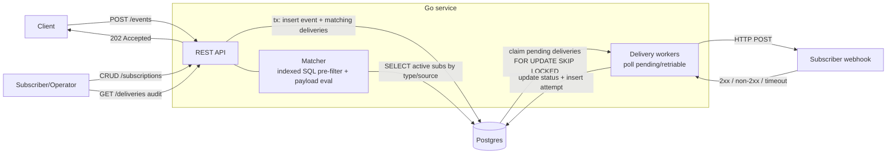
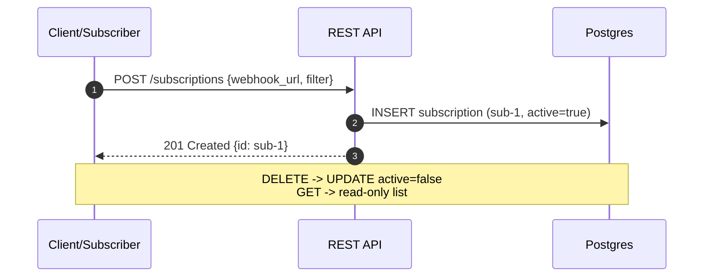
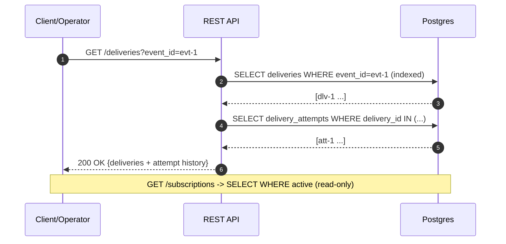
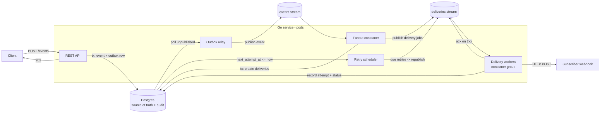

# Architecture — Event-Driven Notification Fanout Service

> Scope note: This is a deliberately **time-boxed (~2–2.5h) design**. The goal is a
> correct, observable, testable core that satisfies the mandatory functional
> requirements, with clear seams where a production system would harden. Every base
> design choice is called out with its trade-off in
> [§3 Design decisions & trade-offs](#3-design-decisions--trade-offs) and revisited in
> [§12 Harden next](#12-harden-next-revisiting-trade-offs--extensions).

## 1. Overview

A single Go service that:

1. Ingests structured events over REST and persists them durably.
2. Matches each event against subscriber filter rules.
3. Fans out a **delivery** per matching subscription and POSTs to the subscriber webhook.
4. Retries failed deliveries with exponential backoff.
5. Exposes delivery state and full attempt history for audit.

We keep everything in **one Go binary backed by Postgres**. The database is the
durable event store, the subscription store, the delivery/audit store, and a
transactional **outbox** that drives the delivery workers. Subscription matching is a
direct, indexed query per event — **no in-memory cache in the base design** (see
[§3](#3-design-decisions--trade-offs)). No external broker is required for the core build.

## 2. Design assumptions

These assumptions justify the base design's simplifications. If they don't hold, the
relevant [§12](#12-harden-next-revisiting-trade-offs--extensions) extension applies.

- **Filters are type/source + flat payload.** Subscriptions predominantly specify a
  `type` and/or `source` (not mostly wildcards), and payload conditions are on
  **top-level keys** with simple operators. This makes an **indexed SQL pre-filter on
  `(type, source)` highly selective**, so a per-event query returns a small candidate
  set rather than the whole table — which is what makes skipping the subscription
  cache viable.
- **Subscription churn ≪ event ingestion rate**, and the active subscription set is
  modest (thousands, not millions).
- **Webhook endpoints are HTTP(S)** and normally respond within a short timeout.
- **Subscribers tolerate at-least-once delivery** and can de-duplicate using the
  delivery `id` as an idempotency key.
- **Throughput is moderate**, consistent with the time-boxed scope (a real broker is
  an extension, not a baseline requirement).
- **Audit/read query volume is modest** relative to ingest, so reads can be served from
  the primary Postgres without a read replica.

## 3. Design decisions & trade-offs

Each base-design choice, why we made it, what we give up, and where we revisit it.

1. **Postgres as the single datastore** (vs. multiple/specialized stores).
   - *Why:* one system to run; ACID transactions enable the outbox pattern; `jsonb`
     handles arbitrary payloads/filters; great audit query support.
   - *Trade-off:* not a best-in-class queue or high-write-throughput engine.
   - *Revisited in* [§12.2](#122-managed-queue-as-the-fanout-backbone).

2. **DB-as-queue: transactional outbox + `FOR UPDATE SKIP LOCKED`** (vs. a real
   message broker).
   - *Why:* deliveries are created atomically with the event insert (no dual-write,
     nothing silently dropped); workers claim rows concurrently without an extra
     dependency.
   - *Trade-off:* polling overhead; throughput ceiling vs. a broker; no native delayed
     messages (we model retry timing with `next_attempt_at`).
   - *Revisited in* [§12.2](#122-managed-queue-as-the-fanout-backbone).

3. **Per-event indexed SQL match** (vs. an in-memory subscription cache).
   - *Why:* always fresh (no staleness), no warm-up/reconcile, no multi-pod cache
     invalidation; the `(type, source)` index keeps each query cheap and selective
     (per [§2](#2-design-assumptions)). Subscription changes take effect immediately
     with no restart, because the next event's query sees the committed row.
   - *Trade-off:* a DB round-trip on the ingest hot path; degrades if filters are
     mostly wildcards (pre-filter returns most of the table) or the subscription set
     is huge.
   - *Revisited in* [§12.1](#121-subscription-read-through-cache).

4. **Denormalize `type`/`source` onto `subscriptions`** (vs. matching on the `filter`
   JSON directly).
   - *Why:* gives a plain `(type, source)` btree index to back the selective per-event
     pre-filter ([§3.3](#3-design-decisions--trade-offs)); the `filter` JSON stays the
     source of truth.
   - *Trade-off:* small redundancy — the columns must be kept in sync with `filter` on
     every write (single writer makes this safe).

5. **Synchronous fanout inside the ingest transaction** (vs. async fanout).
   - *Why:* event + all matching `deliveries` commit atomically → durability without a
     dual-write; simplest correct design.
   - *Trade-off:* ingest latency grows with the number of matches; a very large fanout
     slows the request.
   - *Revisited in* [§12.2](#122-managed-queue-as-the-fanout-backbone) (move fanout
     async behind a relay).

6. **At-least-once delivery** (vs. at-most-once / exactly-once).
   - *Why:* deliveries are persisted before sending, so nothing is lost on crash.
   - *Trade-off:* subscribers may see duplicates and must dedupe on delivery `id`.
   - *Revisited in* [§12.3](#123-other-extensions) (idempotency-key handshake).

7. **In-process worker pool** (vs. a separate worker service).
   - *Why:* one binary, one deployment, shared code/config; easy local + DOKS run.
   - *Trade-off:* API and workers scale together, not independently.
   - *Revisited in* [§12.2](#122-managed-queue-as-the-fanout-backbone) (queue consumers
     as their own deployment).

8. **Soft-delete subscriptions (`active = false`)** (vs. hard delete).
   - *Why:* preserves referential history for delivery audit.
   - *Trade-off:* table growth; queries must filter `active`.

9. **Fail-closed ingestion** (vs. accept-then-persist).
   - *Why:* if Postgres is unavailable we return `5xx` rather than accept and risk
     dropping — honors the durability requirement.
   - *Trade-off:* ingest availability is coupled to DB availability.

10. **Serve audit/read queries from the primary Postgres** (vs. a read replica or
    separate read store).
    - *Why:* no extra infra; indexes on `deliveries(event_id)` /
      `deliveries(subscription_id)` keep audit lookups cheap; reads are always
      strongly consistent with writes.
    - *Trade-off:* heavy audit traffic competes with ingest/worker load on one DB; no
      retention strategy means `delivery_attempts` grows unbounded.
    - *Revisited in* [§12.3](#123-other-extensions).

## 4. High-level flow



### Ingest path (synchronous, transactional)

Step-by-step, with the data-model state after each step (assume one matching
subscription `sub-1`):

1. **`POST /events`** — client submits an event. The API validates the body
   (required `type`, `source`; `payload` is valid JSON). No writes yet.

   _Data model: unchanged._

2. **Begin transaction + insert event** into the `events` table.

   ```text
   events
   id        type           source        payload                  created_at
   evt-1     order.created  checkout-svc   {"amount":120,...}       16:00:00Z
   ```

3. **Match subscriptions** — query candidate subscriptions from Postgres with an
   **indexed pre-filter** (`active AND type/source match`), then evaluate payload
   predicates in Go on that small candidate set. No cache (see
   [§3.3](#3-design-decisions--trade-offs)).

   _Data model: unchanged (read-only `SELECT` against `subscriptions`)._

4. **Insert one `deliveries` row per match** with `status = pending`,
   `attempts = 0`, `next_attempt_at = now()`.

   ```text
   deliveries
   id        event_id  subscription_id  status   attempts  next_attempt_at
   dlv-1     evt-1     sub-1            pending  0         16:00:00Z
   ```

5. **Commit transaction.** Event + its deliveries become durable atomically.

   _Data model: rows from steps 2 & 4 are now committed (visible to workers)._

6. **Return `202 Accepted`** with `{ "event_id": "evt-1" }`. Because everything was
   committed before responding, an accepted event is **never silently dropped**
   (durability requirement).

   _Data model: unchanged._

```mermaid
sequenceDiagram
    autonumber
    participant C as Client
    participant API as REST API (Matcher)
    participant DB as Postgres
    C->>API: POST /events
    API->>DB: BEGIN; INSERT event (evt-1)
    API->>DB: SELECT candidate subs WHERE active AND type/source match
    DB-->>API: [sub-1]
    API->>API: evaluate payload predicates -> [sub-1]
    API->>DB: INSERT delivery (dlv-1, status=pending)
    API->>DB: COMMIT
    API-->>C: 202 Accepted {event_id: evt-1}
```

### Delivery path (asynchronous)

A pool of N worker goroutines loops. Step-by-step, with the data-model state after
each step (continuing with `dlv-1`):

1. **Claim due deliveries** — `SELECT ... FOR UPDATE SKIP LOCKED` for rows with
   `status IN (pending, retrying)` and `next_attempt_at <= now()`. The row is locked
   for this worker within its transaction.

   ```text
   deliveries
   id        status   attempts  next_attempt_at     (row locked by worker)
   dlv-1     pending  0         16:00:00Z
   ```

2. **POST to the webhook** — send the event payload to the subscriber's
   `webhook_url` with a timeout. No DB change yet.

   _Data model: unchanged (awaiting HTTP response)._

3. **Record the attempt** — insert a `delivery_attempts` row capturing the result
   (timestamp, HTTP status, error, duration).

   ```text
   delivery_attempts
   id        delivery_id  attempted_at  http_status  error  duration_ms
   att-1     dlv-1        16:00:01Z     200          NULL   42
   ```

4. **Update delivery status** based on the outcome, then commit:
   - **`2xx` → `delivered`** (terminal).
   - **failure** (non-2xx / timeout) → `attempts++`, compute backoff, set
     `next_attempt_at`, `status = retrying`.
   - **`attempts >= max_attempts`** → `status = failed` (dead-lettered in place).

   ```text
   deliveries  (success case)
   id        status     attempts  next_attempt_at
   dlv-1     delivered  1         NULL

   deliveries  (retry case)
   id        status     attempts  next_attempt_at
   dlv-1     retrying   1         16:00:31Z
   ```

```mermaid
sequenceDiagram
    autonumber
    participant W as Delivery worker
    participant DB as Postgres
    participant WH as Subscriber webhook
    W->>DB: BEGIN; claim due deliveries (FOR UPDATE SKIP LOCKED)
    DB-->>W: dlv-1
    W->>WH: POST payload to webhook_url
    WH-->>W: 2xx / non-2xx / timeout
    W->>DB: INSERT delivery_attempts (att-1)
    alt 2xx
        W->>DB: UPDATE dlv-1 status=delivered
    else failure & attempts < max
        W->>DB: UPDATE dlv-1 status=retrying, next_attempt_at=+backoff
    else attempts >= max
        W->>DB: UPDATE dlv-1 status=failed
    end
    W->>DB: COMMIT
```

### Subscription management path (synchronous)

Subscriptions live in the `subscriptions` table only (no cache in the base design), so
a write takes effect **immediately and without a restart** — the next event's matching
query sees the committed row. Step-by-step for a create (delete and list are analogous):

1. **`POST /subscriptions`** — client submits `{ webhook_url, filter }`. The API
   validates the URL and parses the filter rule. No writes yet.

   _Data model: unchanged._

2. **Insert subscription** into the `subscriptions` table with `active = true`.

   ```text
   subscriptions
   id        webhook_url              filter                          active
   sub-1     https://sub.example/hook {"type":"order.created",...}     true
   ```

3. **Return `201 Created`** with the subscription `id`.

   _Data model: unchanged._

For **`DELETE /subscriptions/{id}`** the row is soft-deleted (`active = false`); for
**`GET /subscriptions`** the API reads from the DB with no mutation.



### Audit & read path (synchronous, read-only)

Serves the **delivery audit** requirement (`GET /deliveries`) plus subscription
listing (`GET /subscriptions`). These are pure reads against Postgres — no writes, no
transaction beyond the implicit read — served directly from the primary
(see [§3.10](#3-design-decisions--trade-offs)). Step-by-step for the audit query:

1. **`GET /deliveries?event_id=evt-1`** (or `?subscription_id=sub-1`) — the API
   validates exactly one filter param is present and parses pagination
   (`limit`/`cursor`).

   _Data model: unchanged._

2. **Query delivery state** — `SELECT` from `deliveries` filtered by `event_id`
   (uses the `deliveries(event_id)` index) or `subscription_id`.

   _Data model: unchanged (read-only)._

3. **Join attempt history** — for the matched deliveries, read `delivery_attempts`
   (HTTP status, timestamps, error, duration) to assemble the per-delivery history.

   _Data model: unchanged (read-only)._

4. **Return `200 OK`** with delivery status + ordered attempt history.

   ```text
   GET /deliveries?event_id=evt-1  -> 200
   {
     "deliveries": [
       { "id": "dlv-1", "subscription_id": "sub-1", "status": "delivered",
         "attempts": [
           { "attempted_at": "16:00:01Z", "http_status": 200, "duration_ms": 42 }
         ] }
     ]
   }
   ```

   _Data model: unchanged._

`GET /subscriptions` is the analogous read: `SELECT ... WHERE active` with pagination,
no mutation.



## 5. Components

| Component | Responsibility |
|---|---|
| **HTTP API** (`net/http` + `chi`) | Request handling, validation, JSON I/O |
| **Store** (Postgres via `pgx`) | Durable persistence; events, subscriptions, deliveries, attempts |
| **Matcher** | Per event: indexed SQL pre-filter on `(type, source)`, then evaluates payload predicates in Go on the candidate set |
| **Worker pool** | Claims due deliveries, sends webhooks, applies retry/backoff |
| **Observability** | Structured logs, `/healthz`, `/readyz`, basic Prometheus `/metrics` |

## 6. Data model (Postgres)

```sql
events(
  id uuid pk, type text, source text, payload jsonb,
  created_at timestamptz
)

subscriptions(
  id uuid pk, webhook_url text, filter jsonb,
  type text,              -- denormalized from filter for the match pre-filter
  source text,            -- denormalized from filter for the match pre-filter
  active bool, created_at timestamptz
)

deliveries(
  id uuid pk,
  event_id uuid -> events,
  subscription_id uuid -> subscriptions,
  status text,            -- pending | retrying | delivered | failed
  attempts int,
  next_attempt_at timestamptz,
  created_at, updated_at timestamptz
)

delivery_attempts(
  id uuid pk,
  delivery_id uuid -> deliveries,
  attempted_at timestamptz,
  http_status int,        -- nullable on transport error
  error text,             -- nullable
  duration_ms int
)
```

Indexes:
- `subscriptions(type, source) WHERE active` — selective pre-filter for the per-event
  match query (the key index that makes the no-cache design viable).
- `deliveries(status, next_attempt_at)` — worker claim query.
- `deliveries(event_id)`, `deliveries(subscription_id)` — audit queries.

## 7. REST API

| Method | Path | Purpose |
|---|---|---|
| `POST` | `/events` | Ingest an event → `202 {event_id}` |
| `POST` | `/subscriptions` | Create subscription |
| `GET` | `/subscriptions` | List subscriptions |
| `DELETE` | `/subscriptions/{id}` | Delete (soft) subscription |
| `GET` | `/deliveries?event_id=` / `?subscription_id=` | Delivery state + history (audit) |
| `GET` | `/healthz`, `/readyz`, `/metrics` | Ops |

### Event body

```json
{ "type": "order.created", "source": "checkout-svc", "payload": { "amount": 120, "region": "us" } }
```

## 8. Filter rule syntax

A subscription's `filter` is JSON. An event matches if **all** present clauses match
(logical AND). Absent fields are wildcards. (Per [§2](#2-design-assumptions), filters
are expected to set `type`/`source` and use flat payload conditions.)

```json
{
  "type": "order.created",
  "source": "checkout-svc",
  "payload": { "region": "us", "amount": { "gt": 100 } }
}
```

- `type` / `source`: exact string match (omit = match any). Used by the indexed
  pre-filter.
- `payload`: map of top-level keys to either a literal (equality) or one operator
  object: `eq`, `gt`, `gte`, `lt`, `lte`. (Top-level keys only in the time-boxed build.)

## 9. Delivery guarantees & failure modes

**Guarantee: at-least-once per subscriber.**

- A delivery is committed to the DB before the worker attempts it, so a crash mid-send
  cannot lose it — it remains `pending`/`retrying` and is re-claimed.
- A subscriber may receive **duplicates** (e.g. webhook returns 200 but we crash before
  marking `delivered`). Subscribers should treat the delivery `id` as an idempotency key.
- Retries: exponential backoff (e.g. `base * 2^attempt`, capped) up to `max_attempts`,
  then `failed`.

### Why not at-most-once or exactly-once

- **At-most-once** would require marking a delivery done *before* sending (or not
  retrying), which risks silently losing notifications — unacceptable for this service.
- **Exactly-once** end-to-end over arbitrary webhooks is not achievable without
  subscriber cooperation: HTTP delivery + our crash window means the receiver can always
  observe a duplicate. We therefore target at-least-once and push **effective
  exactly-once to the subscriber** via an idempotency key (delivery `id`); a server-side
  handshake is an extension ([§12.3](#123-other-extensions)).

### Failure modes & recovery

| Failure | System behavior | Guarantee impact | Recovery / mitigation |
|---|---|---|---|
| API crashes **before** ingest commit | Transaction rolls back; no event/deliveries persisted | None (nothing accepted) | Client receives no `202` → client retries |
| API crashes **after** commit, before `202` reaches client | Event + deliveries are durable; client never saw the ack | Possible **duplicate event** if client retries (ingest is not idempotent) | Idempotency key on ingest ([§12.3](#123-other-extensions)) |
| Postgres unavailable at ingest | Ingest returns `5xx` (fail-closed) | None (not accepted, not dropped) | Client retries; availability coupled to DB ([§3.9](#3-design-decisions--trade-offs)) |
| Worker crashes **after** webhook `2xx`, before marking `delivered` | Row stays `pending`/`retrying`, gets re-claimed and re-sent | **Duplicate** at subscriber | Subscriber dedupes on delivery `id` |
| Worker crashes mid-send (before attempt recorded) | Claim transaction rolls back; row lock released | None | Row re-claimed by another worker |
| Webhook returns non-2xx / times out | Attempt recorded; `attempts++`, backoff, `status=retrying` | Delayed delivery | Exponential backoff up to `max_attempts` |
| Webhook permanently down / poison endpoint | Retries exhausted → `status=failed` (dead-lettered in place) | Not delivered (visible in audit) | Operator inspects via `GET /deliveries`; replay/manual ([§12.3](#123-other-extensions)) |
| Postgres unavailable during delivery | Worker tx fails; delivery stays in current state | None (no false `delivered`) | Retried when DB recovers |
| Hung webhook holds row lock (long HTTP call) | Row locked for the duration of the worker tx | Reduced worker throughput | Bounded by per-request HTTP **timeout** |
| Two workers claim the same row | Prevented by `FOR UPDATE SKIP LOCKED` | None (no double-claim) | N/A (by construction) |

> Note: with the [§12.2](#122-managed-queue-as-the-fanout-backbone) queue extension, two
> additional failure modes appear — **outbox relay lag** (event committed but not yet
> published) and **queue unavailability** (ingest still succeeds because it only writes
> the outbox; fanout resumes when the queue recovers).

## 10. Deployment (DOKS)

- Containerized Go binary (multi-stage `Dockerfile`).
- Kubernetes manifests (`Deployment`, `Service`, `ConfigMap`/`Secret`) applied to a
  **DOKS** cluster.
- Postgres: DO Managed Postgres (or an in-cluster Postgres for the time-boxed demo);
  connection string injected via Secret.
- DB schema applied via migrations on startup.

## 11. Testing & CI

- **Unit:** matcher logic, backoff calculation, filter parsing.
- **Integration:** API + Postgres (via `testcontainers` or a CI Postgres service)
  covering ingest → fanout → delivery to a stub webhook server → audit query.
- **CI:** GitHub Actions on push: `go vet`, `go test ./...` with a Postgres service
  container.

## 12. Harden next: revisiting trade-offs & extensions

Each base-design trade-off from [§3](#3-design-decisions--trade-offs) and the concrete
extension that addresses it.

### 12.1 Subscription read-through cache

**Revisits [§3.3](#3-design-decisions--trade-offs).** When filters become wildcard-heavy
(pre-filter loses selectivity) or the subscription set / ingest rate grows enough that
the per-event match query dominates, add an in-memory read-through cache so matching
avoids a DB round-trip.

What this re-introduces (and must be designed for):

- **Startup warm-up:** before `/readyz`, load `SELECT * FROM subscriptions WHERE active`
  into memory so the Matcher never runs against an empty cache. Postgres stays the
  source of truth; the cache is a derived read-model.
- **Write-through + periodic reconcile:** writes update DB then cache; a 30–60s ticker
  reloads to repair drift and bound staleness.
- **Multi-replica invalidation:** with >1 pod, a write on pod A doesn't update pod B's
  cache. Either accept eventual consistency bounded by the reconcile interval, or push
  invalidations to all pods via Postgres `LISTEN/NOTIFY` or Redis pub/sub.

*Trade-off of adding it:* lower match latency at the cost of staleness windows and the
cache-coherence complexity the base design deliberately avoids.

### 12.2 Managed queue as the fanout backbone

**Revisits [§3.1](#3-design-decisions--trade-offs), [§3.2](#3-design-decisions--trade-offs),
[§3.5](#3-design-decisions--trade-offs), [§3.7](#3-design-decisions--trade-offs).** For
higher throughput and to decouple/scale workers independently, introduce a managed
queue (e.g. **DO Managed Redis/Valkey Streams** for the time-boxed extension, or
**Managed Kafka** at larger scale) as the work-distribution backbone — while Postgres
stays the source of truth and audit store.

Use a **transactional outbox + relay** so we never dual-write in the request path:

1. **Ingest** writes the event + an **outbox row** in one transaction (durability
   preserved), then returns `202`.
2. An **outbox relay** publishes committed events to an `events` stream.
3. A **fanout consumer** matches subscriptions, writes `deliveries` rows, and publishes
   delivery jobs to a `deliveries` stream.
4. **Delivery workers** (a consumer group, their own deployment) consume jobs, POST to
   webhooks, record attempts/status in Postgres, and ack on success.
5. A **retry scheduler** republishes due retries (queues lack native delayed messages;
   keep `next_attempt_at` in Postgres as the retry clock and republish, or use a Redis
   ZSET / Kafka tiered retry topics).



*Still at-least-once:* consumer-group ack (`XACK` / offset commit) redelivers in-flight
jobs after a crash; duplicates remain possible (idempotency on delivery `id`). New
failure modes to document: relay lag (event committed, not yet published) and queue
unavailability (ingest still succeeds because it only writes the outbox). **Kafka
partitioning** also sets up the per-source ordering extension below.

### 12.3 Other extensions

- **Effectively-once at the subscriber** — idempotency-key handshake / dedup store
  (revisits [§3.6](#3-design-decisions--trade-offs)).
- **Per-source ordered delivery** — partition by `source` (natural on Kafka from
  [§12.2](#122-managed-queue-as-the-fanout-backbone)); serialize a source's deliveries
  to a subscriber.
- **Idempotent ingestion** — accept a client-supplied idempotency key (or dedupe on a
  natural event id) so a client retry after a lost `202` doesn't create a duplicate
  event (revisits the ingest-crash failure mode in [§9](#9-delivery-guarantees--failure-modes)).
- **Replay API** — re-deliver events over a time range from the durable `events` store
  (useful after a subscriber outage).
- **Richer filters** — nested `AND`/`OR` expressions, nested payload paths.
- **Audit/read scaling** — serve `GET /deliveries` / `GET /subscriptions` from a read
  replica, add cursor pagination at scale, and apply retention/archival (or rollups)
  for `delivery_attempts` so audit history doesn't grow unbounded (revisits
  [§3.10](#3-design-decisions--trade-offs)).
- **Security & ops** — API auth/authn, **SSRF protection on subscriber-supplied webhook
  URLs** (block private/link-local ranges, allowlist schemes), signed webhooks (HMAC),
  rate limiting, a dedicated DLQ surface, and richer metrics/tracing with alerting on
  `failed` rate.
