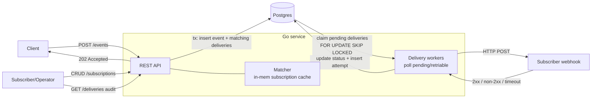

# Architecture — Event-Driven Notification Fanout Service

> Scope note: This is a deliberately **time-boxed (~2–2.5h) design**. The goal is a
> correct, observable, testable core that satisfies the mandatory functional
> requirements, with clear seams where a production system would harden. See
> [What we sacrifice vs. what we'd harden next](#what-we-sacrifice-vs-what-wed-harden-next).

## 1. Overview

A single Go service that:

1. Ingests structured events over REST and persists them durably.
2. Matches each event against subscriber filter rules.
3. Fans out a **delivery** per matching subscription and POSTs to the subscriber webhook.
4. Retries failed deliveries with exponential backoff.
5. Exposes delivery state and full attempt history for audit.

We keep everything in **one Go binary backed by Postgres**. The database doubles as
the durable event store, the subscription store, and a transactional **outbox** that
drives the delivery workers. No external broker is required for the core build.

## 2. High-level flow



### Ingest path (synchronous, transactional)

1. `POST /events` validates the body, then in a **single DB transaction**:
   - inserts the event (`events` table),
   - evaluates the in-memory subscription set,
   - inserts one `deliveries` row (`status = pending`) per matching subscription.
2. Returns `202 Accepted` with the `event_id`. Because the event and its deliveries
   are committed atomically before responding, an accepted event is **never silently
   dropped** (durability requirement).

### Delivery path (asynchronous)

A pool of N worker goroutines loops:

1. Claim a batch of due deliveries (`status IN (pending, retrying)` and
   `next_attempt_at <= now()`) using `SELECT ... FOR UPDATE SKIP LOCKED`.
2. POST the event payload to the subscriber's webhook URL with a timeout.
3. Record a row in `delivery_attempts` (timestamp, HTTP status, error).
4. On `2xx` → `delivered`. On failure → increment attempt count, compute backoff,
   set `next_attempt_at`; after `max_attempts` → `failed` (dead-lettered in place).

## 3. Components

| Component | Responsibility |
|---|---|
| **HTTP API** (`net/http` + `chi`) | Request handling, validation, JSON I/O |
| **Store** (Postgres via `pgx`) | Durable persistence; events, subscriptions, deliveries, attempts |
| **Subscription cache** | In-memory copy of subscriptions for fast matching; refreshed on write + periodic reload |
| **Matcher** | Evaluates an event against filter rules |
| **Worker pool** | Claims due deliveries, sends webhooks, applies retry/backoff |
| **Observability** | Structured logs, `/healthz`, `/readyz`, basic Prometheus `/metrics` |

## 4. Data model (Postgres)

```sql
events(
  id uuid pk, type text, source text, payload jsonb,
  created_at timestamptz
)

subscriptions(
  id uuid pk, webhook_url text, filter jsonb,
  active bool, created_at timestamptz
)

deliveries(
  id uuid pk,
  event_id uuid -> events,
  subscription_id uuid -> subscriptions,
  status text,            -- pending | retrying | delivered | failed
  attempts int,
  next_attempt_at timestamptz,
  created_at, updated_at timestamptz
)

delivery_attempts(
  id uuid pk,
  delivery_id uuid -> deliveries,
  attempted_at timestamptz,
  http_status int,        -- nullable on transport error
  error text,             -- nullable
  duration_ms int
)
```

Indexes: `deliveries(status, next_attempt_at)` for the worker claim query;
`deliveries(event_id)` and `deliveries(subscription_id)` for audit queries.

## 5. REST API

| Method | Path | Purpose |
|---|---|---|
| `POST` | `/events` | Ingest an event → `202 {event_id}` |
| `POST` | `/subscriptions` | Create subscription |
| `GET` | `/subscriptions` | List subscriptions |
| `DELETE` | `/subscriptions/{id}` | Delete (soft) subscription |
| `GET` | `/deliveries?event_id=` / `?subscription_id=` | Delivery state + history (audit) |
| `GET` | `/healthz`, `/readyz`, `/metrics` | Ops |

### Event body

```json
{ "type": "order.created", "source": "checkout-svc", "payload": { "amount": 120, "region": "us" } }
```

## 6. Filter rule syntax

A subscription's `filter` is JSON. An event matches if **all** present clauses match
(logical AND). Absent fields are wildcards.

```json
{
  "type": "order.created",
  "source": "checkout-svc",
  "payload": { "region": "us", "amount": { "gt": 100 } }
}
```

- `type` / `source`: exact string match (omit = match any).
- `payload`: map of top-level keys to either a literal (equality) or one operator
  object: `eq`, `gt`, `gte`, `lt`, `lte`. (Top-level keys only in the time-boxed build.)

## 7. Delivery guarantees

**At-least-once per subscriber.**

- A delivery is committed to the DB before the worker attempts it, so a crash mid-send
  cannot lose it — it remains `pending`/`retrying` and is re-claimed.
- A subscriber may receive **duplicates** (e.g. webhook returns 200 but we crash before
  marking `delivered`). Subscribers should treat the delivery `id` as an idempotency key.
- Retries: exponential backoff (e.g. `base * 2^attempt`, capped) up to `max_attempts`,
  then `failed`.
- **Failure conditions:** webhook non-2xx or timeout → retry; exhausted attempts →
  `failed` (visible via audit). Postgres unavailable → ingestion returns `5xx`
  (we fail closed rather than accept-and-drop).

## 8. Deployment (DOKS)

- Containerized Go binary (multi-stage `Dockerfile`).
- Kubernetes manifests (`Deployment`, `Service`, `ConfigMap`/`Secret`) applied to a
  **DOKS** cluster.
- Postgres: DO Managed Postgres (or an in-cluster Postgres for the time-boxed demo);
  connection string injected via Secret.
- DB schema applied via migrations on startup.

## 9. Testing & CI

- **Unit:** matcher logic, backoff calculation, filter parsing.
- **Integration:** API + Postgres (via `testcontainers` or a CI Postgres service)
  covering ingest → fanout → delivery to a stub webhook server → audit query.
- **CI:** GitHub Actions on push: `go vet`, `go test ./...` with a Postgres service
  container.

## 10. What we sacrifice vs. what we'd harden next

**Sacrificed for simplicity (time-boxed):**
- DB-as-queue instead of a real broker (Kafka/Redis Streams).
- Single-process workers; horizontal scale relies on `SKIP LOCKED` correctness but
  isn't load-tested.
- No auth/authn on the API.
- Flat AND-only filters, top-level payload keys only.
- Failed deliveries dead-letter in place (no separate DLQ surface).

**Would harden next:**
- Managed message queue as the fanout backbone for throughput + decoupling.
- Per-source **ordered delivery** to a subscriber.
- **Replay API** (re-deliver events over a time range).
- Idempotency-key handshake for true effectively-once at the subscriber.
- Nested/`AND`/`OR` filter expressions, signed webhooks (HMAC), rate limiting.
- Richer metrics/tracing and alerting on `failed` delivery rate.
```

